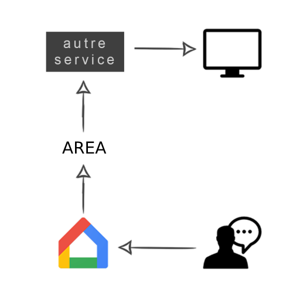

***************
Action REAction
***************

Welcome to our AREA documentation!
====================================

**AREA** is the final project made in our third year in Epitech.
The goal of this project is to discover, as a whole, the software platform that you have chosen through the creation of a business application.
To do this, we implement a software suite that functions similar to that of IFTTT and/or Zapier.

This software suite will be broken into three parts :  
- **An application server** to implement all the features listed below (see Features)
- **A web client** to use the application from your browser by querying the application server
- **A mobile client** to use the application from your phone by querying the application server

Schema
======

--> Represents the interaction between SERVER/IA and SERVER/GUI.

Information
===========

.. note::

   We are a team of 5 students on this project.
   To divide the work, 2 people are in charge of each of the 3 parts that will be detailed in this documentation.

.. warning::

   This project requires a lot of work during 8 weeks.
   Time management must be well thought out in order to complete this project on time!

Contents
========
.. toctree::
   Usage
